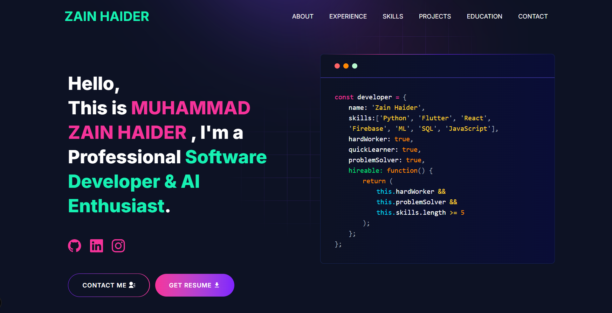

# Portfolio of Muhammad Zain Haider

A modern, responsive portfolio website showcasing my skills, projects, and experience.

## 🎬 Demo

  

  <a href="https://YOUR-VERCEL-URL.vercel.app" target="_blank">
    <strong>🚀 View Live Site</strong>
  </a>

## 💻 Tech Stack

- **Framework:** Next.js 16
- **Styling:** Tailwind CSS
- **Deployment:** Vercel

## 👨‍💻 About Me

I'm Muhammad Zain Haider, a Software Developer & AI Enthusiast with expertise in:

- Python & Machine Learning
- Flutter & Mobile Development
- React & Web Development
- Data Visualization & Analytics

## 📫 Contact

- **Email:** zainhaider299@gmail.com
- **LinkedIn:** [Zain Haider](https://www.linkedin.com/in/zain-haider-63a3b6286/)
- **GitHub:** [Zain4433](https://github.com/Zain4433)
- **Instagram:** [@zain.haider_](https://www.instagram.com/zain.haider_)

## 📄 License

This project is open source and available under the MIT License.
